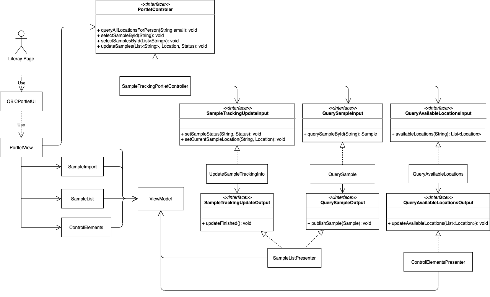

# Sample Tracking Update Portlet

Sample Tracking Update Portlet, version 1.0.0-SNAPSHOT - Portlet to update sample status

## Author
Created by all the [contributors](https://github.com/qbicsoftware/sample-tracking-update-portlet/graphs/contributors)

## Description
A Liferay portlet to update the sample-tracking information of selected samples.

## Architecture

## How to Install
1. clone repository
2. install maven
3. run `mvn clean package`

## How to Use 
This guide intends to showcase the features of the sample-tracking-update-portlet. 

* [Add Samples](#select-samples):
  * [Add Sample by ID](#select-sample-by-id)
  * [Add Samples by File](#select-samples-by-file)
* [Update Sample Information](#update-sample-information):
    * [Update Sample Date](#update-sample-date)
    * [Update Sample Location](#update-sample-location)
    * [Update Sample Status](#update-sample-status)
* [Clear Selected Samples](#clear-selected-samples)

##Select Samples
The sample-tracking-update-portlet currently offers two methods for adding the samples to update.  
This can be achieved by either uploading a *.csv file containing the SampleIds in the first column 
or by providing the Sample IDs directly. 
Details for both methods are outlined below. 

###Select Sample by ID
The most convenient way of updating a singular sample is through the input of its sample code 
into the "Sample ID" text field and pressing the "Add Sample Button". 
If the given sample ID is valid, the sample and its associated information will appear in the sample grid 
<!---
Insert Singular Sample Screenshot
-->
Each subsequent Sample ID will be added to the "Samples to update" grid 
 <!---
Insert Multiple Sample Screenshot
 -->
 
###Select Samples by File
It is possible to select the samples of interest by 
uploading one or multiple *.csv file containing the sample codes in the first column.
A template file can be seen [here](doc/templates/SampleTrackingUpdateTemplate.csv)  
If the SampleIds in the template file are valid, 
the samples and their associated information will appear in the sample grid
<!---
Insert Samples from File Screenshot here
-->
Subsequent Sample IDs from either a *.csv file or by direct input will also be added to the "Samples to update" grid 
 <!---
Insert Multiple Sample Source Screenshot
 -->
 
##Update Sample Information

###Update Sample Date

###Update Sample Location

###Update Sample Status

##Clear Selected Samples