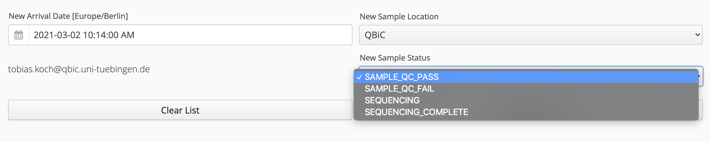
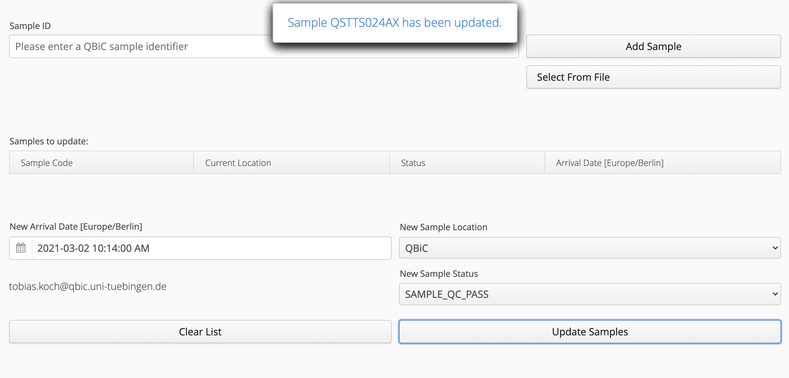
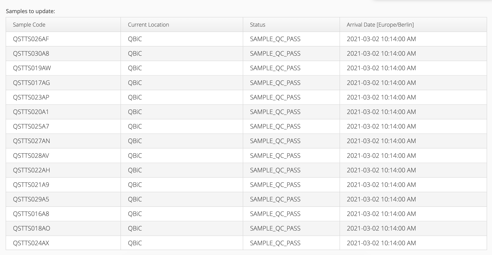

# Sample Tracking Update Portlet

Sample Tracking Update Portlet, version 1.0.0-SNAPSHOT - Portlet to update sample status

## Author
Created by all the [contributors](https://github.com/qbicsoftware/sample-tracking-update-portlet/graphs/contributors)

## Description
A Liferay portlet to update the sample-tracking information of selected samples.

## Architecture

## How to Install
### Prerequisites
1. A [Liferay 6.2 Portal](https://liferay.dev/blogs/-/blogs/liferay-6-2-ce-ga6-now-available)
2. Access to a running instance of the [sample-tracking service](https://github.com/qbicsoftware/sample-tracking-service)
   
3. A running [openBIS instance](https://openbis.ch/)
4. A [configuration file](https://github.com/qbicsoftware/portal-utils-lib#how-portlets-are-configured) providing information about the location of the sample-tracking service as well as the database and the openBIS instance
### Installation
Either run it locally or deploy it on your liferay instance. To run it locally you can execute ``mvn clean jetty:run``. To deploy it on your liferay instance you can create the required ``.war`` file by executing ``mvn clean package``
## How to Use 

This guide intends to showcase the features of the sample-tracking-update-portlet. 

* [Select Samples](#select-samples):
  * [Select Sample by ID](#select-sample-by-id)
  * [Select Samples by File](#select-samples-by-file)
* [Update Sample Information](#update-sample-information):
    * [Update Sample Date](#update-sample-date)
    * [Update Sample Location](#update-sample-location)
    * [Update Sample Status](#update-sample-status)
* [Remove Selected Samples](#remove-selected-samples)

### Select Samples

The sample-tracking-update-portlet currently offers two methods for adding the samples to update.  
This can be achieved by either uploading a *.csv file containing the sample identifiers in the first column 
or by providing sample identifiers directly.   
Details for both methods are outlined below. 

#### Select Sample By ID
The most convenient way of updating a singular sample is through the input of its QBiC sample identifier 
into the "Sample ID" text field and pressing the "Add Sample Button". 

If the given sample identifier is valid, the sample and its associated information will appear in the "Samples to update" grid 

Each subsequent sample identifier will be added to the "Samples to update" grid 

 
#### Select Samples By File
It is also possible to select the samples of interest, by 
uploading one or multiple *.csv files containing the sample codes in the first column.

A template file can be found at [``readme-docs/templates/example.csv``](readme-docs/templates/example.csv).

If the sample identifiers in the csv file are valid, and if they are not already in the list of loaded samples, 
the samples and their associated information will appear in the sample grid.

  
Subsequent sample identifiers from either a *.csv file or by direct input will also be added to the "Samples to update" grid. 
 
### Update Sample Information
After the addition of the samples of interest, the user can update sample specific information,
such as the sample arrival date, the sample location or the processing status of the sample.   
Details for each of these methods are outlined below.   
It should be noted that the change is applied to all samples in the "Samples to update" grid. 
You can either update a single property or update multiple properties at once by pressing the "Update Samples" button.

#### Update Sample Date
To change the arrival date for all selected samples, 
a new arrival date can be specified through manual user input 
or by clicking on the calendar icon of the "New Arrival Date" Field 

The date and time has to provided formatted as prefilled by the system `yyyy-MM-dd hh:mm:ss a`.

Pressing the "Update Samples" button submits your changes.

#### Update Sample Location
To change the location for all selected samples, a new sample location can be selected in the "New Sample Location" dropdown selection.  

Pressing the "Update Samples" button submits your changes.

#### Update Sample Status
To change the status for all selected samples, a new sample status can be selected in the "New Sample Status" dropdown selection.  

Pressing the "Update Samples" button submits your changes.

### Verifying Successful Update
After pressing the "Update Samples" button, the samples will be updated with the provided information.

A successful update can be verified by selecting the samples again and observing the changed information.

Please note, that the information shown reflects the most recent status and location found for the sample, so changes for a past date are not presented.

### Remove Samples From Selection
By pressing the "Clear List" button you can remove all samples from the selection.

 