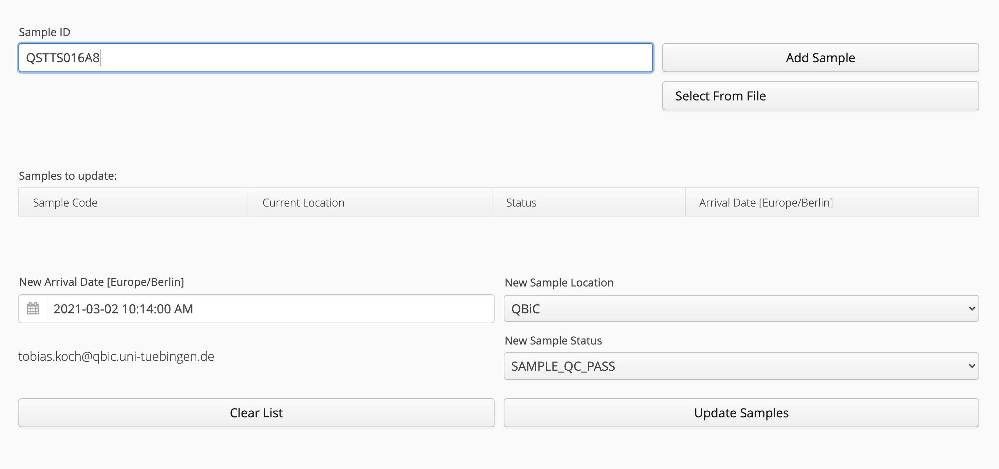
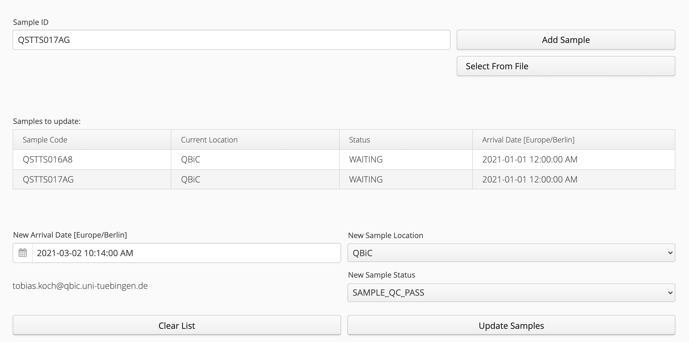
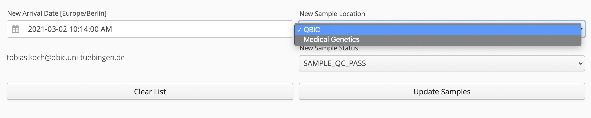
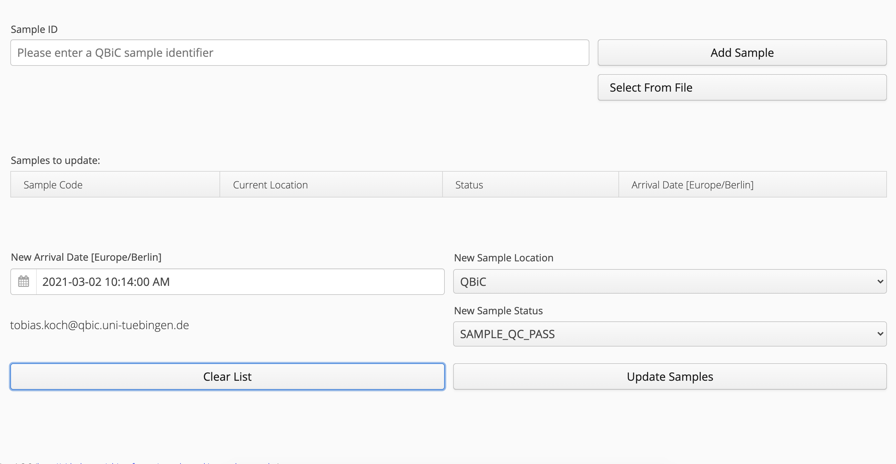

# Sample Tracking Update Portlet

Sample Tracking Update Portlet, version 1.0.0-SNAPSHOT - Portlet to update sample status

## Author
Created by all the [contributors](https://github.com/qbicsoftware/sample-tracking-update-portlet/graphs/contributors)

## Description
A Liferay portlet to update the sample-tracking information of selected samples.

## Architecture

## How to Install
1. clone repository
2. install maven
3. run `mvn clean package`

## How to Use 

This guide intends to showcase the features of the sample-tracking-update-portlet. 

* [Select Samples](#select-samples):
  * [Select Sample by ID](#select-sample-by-id)
  * [Select Samples by File](#select-samples-by-file)
* [Update Sample Information](#update-sample-information):
    * [Update Sample Date](#update-sample-date)
    * [Update Sample Location](#update-sample-location)
    * [Update Sample Status](#update-sample-status)
* [Remove Selected Samples](#remove-selected-samples)

### Select Samples

The sample-tracking-update-portlet currently offers two methods for adding the samples to update.  
This can be achieved by either uploading a *.csv file containing the Sample Ids in the first column 
or by providing the Sample IDs directly.   
Details for both methods are outlined below. 

#### Select Sample by ID
The most convenient way of updating a singular sample is through the input of its sample code 
into the "Sample ID" text field and pressing the "Add Sample Button". 

If the given sample ID is valid, the sample and its associated information will appear in the "Samples to update" grid 

Each subsequent Sample ID will be added to the "Samples to update" grid 

 
#### Select Samples by File
It is also possible to select the samples of interest by 
uploading one or multiple *.csv files containing the sample codes in the first column.

A template file can be seen [here](readme-docs/templates/ExampleCsv.csv)  
If the Sample Ids in the csv file are valid, 
the samples and their associated information will appear in the sample grid.

  
Subsequent Sample IDs from either a *.csv file or by direct input will also be added to the "Samples to update" grid. 

 
### Update Sample Information
After the addition of the samples of interest, the user can update sample specific information,
such as the sample arrival date, the sample location or the processing status of the sample.   
Details for each of these methods are outlined below.   
It should be noted that the change is applied to all samples in the "Samples to update" grid. 

#### Update Sample Date
To change the arrival date for all selected samples, 
a new arrival date can be specified through manual user input 
or by clicking on the calendar icon of the "New Arrival Date" Field 

After pressing the "Update Samples" button the arrival date of all currently selected samples will be updated to the specified date.  

<!--- ToDo How should this be shown, currently we don't show the date in the sample-update-portlet--->

#### Update Sample Location
To change the location for all selected samples, a new sample location can be selected in the "New Sample Location" dropdown selection.  

After pressing the "Update Samples" button the location of all currently selected samples will be updated to the selected location.  

#### Update Sample Status
<!--- ToDo Update Readme section once the Sample Status were updated--->

### Remove Selected Samples
The only way to deselect samples is to clear the entire "Samples to update" grid of all added samples.

This can be easily achieved by clicking the "Clear List" button. 

 